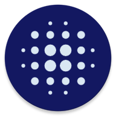
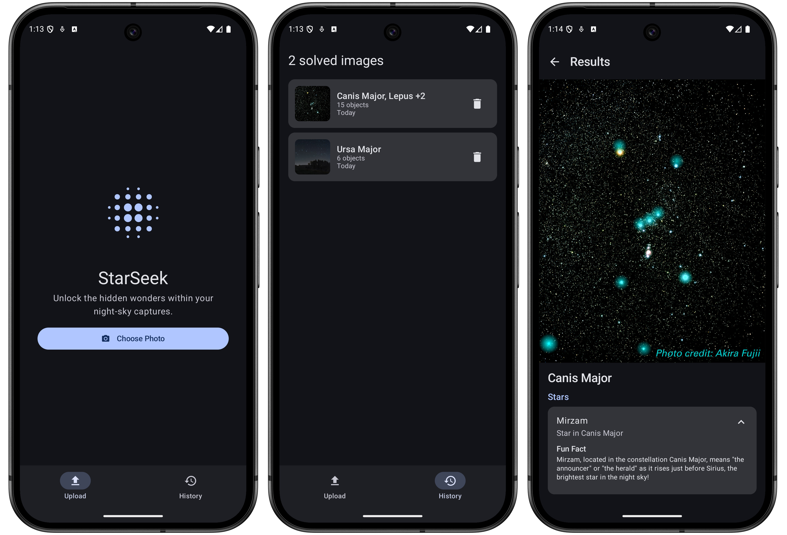

<div align="center">
  
  <h1>StarSeek</h1>
  <p>An Android app for identifying celestial objects in star field images using plate solving technology.</p>

  <!-- Badges -->
  <p>
    
    
    
    
    
    
  </p>

  <h4>
    <a href="https://github.com/oadultradeepfield/StarSeek/issues/">Report Bug</a>
    <span> | </span>
    <a href="https://github.com/oadultradeepfield/StarSeek/issues/">Request Feature</a>
  </h4>
</div>

<br />

## Table of Contents

- [About the Project](#about-the-project)
    - [Screenshots](#screenshots)
    - [Tech Stack](#tech-stack)
    - [Features](#features)
    - [Architecture](#architecture)
- [Getting Started](#getting-started)
    - [Prerequisites](#prerequisites)
    - [Installation](#installation)
- [Usage](#usage)
- [License](#license)
- [Acknowledgements](#acknowledgements)

## About the Project

StarSeek is an astronomy companion app that helps users identify celestial objects in their star
field photographs. Using plate solving technology, the app analyzes uploaded images and identifies
stars, nebulae, galaxies, and star clusters visible in the frame.

### Screenshots



### Tech Stack

**Android Client:**

- Kotlin
- Jetpack Compose
- Material Design 3
- MVVM with Clean Architecture
- Hilt for Dependency Injection
- Kotlin Coroutines and Flow
- Retrofit, OkHttp, Kotlinx Serialization
- Room Database
- Coil

**Backend:**

- Go
- Chi router
- Gemini API for AI-generated fun facts
- Cloudflare KV for caching

### Features

- Upload star field images for analysis
- Automatic plate solving to identify celestial objects
- View annotated images with identified objects highlighted
- Browse identified objects grouped by constellation and type
- View detailed information about each celestial object with AI-generated fun facts
- Cache solved images locally for offline access
- View history of past solves
- Delete saved solves with associated images

### Project Structure

```
├── app/                    # Android application
│   ├── data/
│   │   ├── image/          # Image loading, processing, transformations
│   │   ├── local/          # Room database, DAOs, entities
│   │   ├── remote/         # Retrofit API, DTOs
│   │   ├── repository/     # Repository implementations
│   │   └── mapper/         # Data mappers between layers
│   ├── domain/
│   │   └── model/          # Domain models
│   ├── di/                 # Hilt dependency injection modules
│   └── ui/
│       ├── components/     # Shared UI components
│       ├── theme/          # Material Design 3 theming
│       ├── upload/         # Image upload screen
│       ├── results/        # Solve results screen
│       ├── history/        # History screen
│       ├── debug/          # Debug screens (image benchmarking)
│       └── navigation/     # Navigation setup
└── backend/
    └── container_src/      # Go API server
        ├── cmd/server/     # Entry point
        └── internal/
            ├── client/     # External API clients (Astrometry, Gemini, KV)
            ├── config/     # Environment configuration
            ├── controller/ # HTTP handlers
            ├── model/      # Domain models and catalog data
            ├── service/    # Business logic (solve, object)
            └── view/       # Response DTOs
```

## Getting Started

### Prerequisites

- Android Studio Hedgehog or later
- JDK 11 or later
- Android SDK with minimum API level 24

### Installation

1. Clone the repository

    ```bash
    git clone https://github.com/oadultradeepfield/StarSeek.git
    ```

2. Open the project in Android Studio

3. Sync Gradle files

4. Build and run on an emulator or physical device

## Usage

1. Launch the app and tap the upload button
2. Select a star field image from your gallery or take a new photo
3. Wait for the plate solving analysis to complete
4. Browse the identified celestial objects in the results screen
5. Tap on any object to view detailed information
6. Toggle between original and annotated image views
7. Access your solve history from the history screen

## License

Distributed under the MIT License. See [LICENSE](/LICENSE) for more information.

## Acknowledgements

- [Jetpack Compose](https://developer.android.com/jetpack/compose)
- [Material Design 3](https://m3.material.io/)
- [Hilt](https://dagger.dev/hilt/)
- [Retrofit](https://square.github.io/retrofit/)
- [Coil](https://coil-kt.github.io/coil/)
- [Room](https://developer.android.com/training/data-storage/room)
